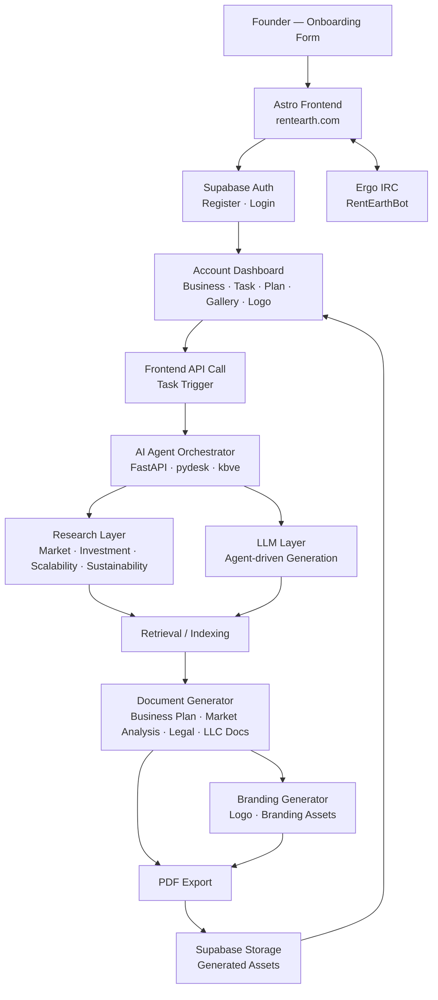

# ATLAS

**DeveloperWeek New York 2026 Hackathon Submission**
**Domain Roulette Track — clocks.works**

> **"Turn Every Hour Into a Launched Startup."**

---

**ATLAS** is an autonomous agent system that compresses the months of business system materials a startup needs — LLC docs, business plans, market analysis, branding, landing pages — into minutes. Built for the **DeveloperWeek New York 2026 Hackathon**, ATLAS demonstrates how a multi-agent AI pipeline can autonomously research, generate, and deliver an entire startup's foundational document suite from a single form submission.

This repository (`@kbve/meme.sh`) is the **Astro + Svelte + React/R3F frontend** for ATLAS, deployed to production as `rentearth.com`.

---

## Try ATLAS Live

[Open ATLAS Web App](https://rentearth.com)

> **Best viewed on:** Desktop or tablet.
> **Sign up** to access the full agent pipeline and dashboard.

### Performance Notes
- Onboarding form: **< 1 minute** to complete
- Market research + document generation: **~2–5 minutes** depending on scope
- PDF export: **< 10 seconds** after generation
  *(Actual times may vary depending on model load and search API response times.)*

---

## The Problem

Launching a startup requires a large volume of business system materials — and producing them the traditional way is slow, expensive, and fragmented:

- **LLC formation documents** — require legal counsel or expensive formation services
- **Articles of incorporation** — jurisdiction-specific, time-consuming to draft correctly
- **Operating and business plans** — weeks of research and writing
- **Market analysis** — requires expensive research tools and analyst time
- **Investment planning** — needs financial modeling expertise
- **Legal disclaimers** — copy-pasted incorrectly from templates, creating liability
- **Website landing page** — requires design and development resources
- **Branding materials** — logo, tone, visual identity — another specialist entirely

Producing this suite traditionally takes **months and tens of thousands of dollars**. Most early-stage founders simply skip it — and pay the price later.

---

## The Solution

ATLAS is an intuitively integrated autonomous agent system that reduces the time and cost of generating the full startup business system materials suite from months to minutes.

After a user submits their target information through the onboarding form, ATLAS autonomously:

1. Runs intelligent multi-source research across market analysis, investment prospects, scalability assessment, and sustainability analysis
2. Synthesizes findings using an LLM-driven agent pipeline
3. Generates polished, ready-to-use text documents and PDFs
4. Produces branding assets for the new venture
5. Delivers everything to the user's dashboard — no manual steps required

---

## High-Level System Overview

ATLAS consists of two integrated services:

- **Astro + Svelte + R3F Frontend (this repo):** A 3D landing experience and account dashboard — users onboard, trigger agent tasks, and receive generated documents through a browser-native interface. Built with Supabase auth/storage and an in-cluster Ergo IRC bot (`RentEarthBot`) for live community chat.
- **FastAPI Agent Backend:** Built on the `kbve` Python package and `pydesk` FastAPI service, this receives task requests, runs the multi-agent research and generation pipeline, and returns generated documents/assets to the frontend.

---

## Deployment Overview

| Component | Technology | Deployment | Purpose |
|---|---|---|---|
| **Frontend** | Astro · Svelte · React | Kubernetes (ArgoCD) — `ghcr.io/kbve/rentearth` → `rentearth.com` | 3D landing, auth, dashboard, document viewer |
| **3D Scene** | Three.js · R3F · Drei | Browser (WebGL) | Immersive landing experience |
| **Auth & Storage** | Supabase | Hosted (in-cluster `kilobase`) | User accounts, database, storage |
| **Realtime Chat** | Ergo IRC | In-cluster (`RentEarthBot`) | Live community/support channel |
| **AI Agent Pipeline** | FastAPI (`pydesk`) · `kbve` package · Pydantic | Backend service | Research, generation, document output |
| **CI/CD** | GitHub Actions + ArgoCD | GitHub / Kubernetes | Build, push image, auto-sync deployment |

---

## Architecture



---

## How the Multi-Agent Pipeline Works

ATLAS orchestrates specialized agents in sequence — each one handling a distinct phase of the startup materials generation process.

### Step 1 — Onboarding: Capturing Founder Intent

The journey begins at the ATLAS onboarding form:

1. The founder fills in their business concept, target market, industry, and goals
2. Supabase stores the structured submission and initializes a task record
3. The frontend triggers the AI agent pipeline via a backend API call
4. A loading state is shown on the dashboard while agents run in the background

---

### Step 2 — Research: Autonomous Multi-Source Intelligence

The agent backend receives the task and begins autonomous research across four domains:

- Market analysis — size, trends, competitor landscape
- Investment prospects — funding activity, investor interest signals
- Scalability assessment — infrastructure and growth pathway analysis
- Sustainability analysis — regulatory, environmental, and long-term viability

Results are extracted, normalized, and indexed for retrieval by the generation step.

---

### Step 3 — Generation: LLM Agents Writing the Documents

With research indexed and retrieved, the generation phase begins:

1. An LLM-driven agent drafts the primary documents — business plans, operating plans, market analysis, and legal disclaimers — using retrieved research as grounding context
2. **Pydantic** validates all structured outputs before they are passed to the document assembly layer
3. The `kbve` / `pydesk` FastAPI service sequences each document section in the correct dependency order

---

### Step 4 — Output: PDFs, Branding, and Dashboard Delivery

Once document text is finalized:

1. Polished, formatted PDF exports are assembled for each document
2. Logo concepts and branding assets are generated based on the business description
3. All files are uploaded to **Supabase Storage**
4. The frontend dashboard updates in real time — the founder sees their complete materials suite ready to download

---

## Technical Innovation

| Innovation | Detail |
|---|---|
| **Full-Suite Autonomous Generation** | No other tool produces the complete startup business materials suite — LLC docs, plans, analysis, branding, landing page — in a single pipeline |
| **Research-Grounded Outputs** | Documents are grounded in live market research, not static templates |
| **Vector-Augmented RAG Pipeline** | Retrieval-augmented generation delivers precise grounding for every document section |
| **3D Immersive Frontend** | Three.js + R3F landing experience — an Atlas statue holding the earth, floating island, animated portal — a product whose visual identity matches its ambition |
| **Realtime Community Layer** | Built-in Ergo IRC bot (`RentEarthBot`) gives the platform a live chat channel out of the box |

---

## Tech Stack

### Frontend Framework

| Technology | Version | Role |
|---|---|---|
| Astro | ^5.10.1 | Core site framework / SSG |
| Svelte | ^5.34.8 | Reactive UI components |
| React | ^18.2.0 | Component rendering host for R3F |
| React DOM | ^18.2.0 | React DOM renderer |

### 3D / WebGL

| Technology | Version | Role |
|---|---|---|
| Three.js | 0.142 | 3D engine |
| @react-three/fiber | 8.0.26 | React renderer for Three.js |
| @react-three/drei | 9.14.3 | R3F helpers — models, controls, loaders |
| @react-three/postprocessing | 2.4.4 | Post-processing visual effects |

### Styling

| Technology | Version | Role |
|---|---|---|
| Tailwind CSS | ^4.1.11 | Utility-first CSS framework |
| @tailwindcss/vite | ^4.1.11 | Vite-native Tailwind integration |
| @tailwindcss/typography | ^0.5.9 | Prose / rich-text styling plugin |
| Flowbite | ^1.8.1 | UI component library |
| Flowbite Svelte | ^0.44.2 | Svelte bindings for Flowbite |
| Flowbite React | ^0.5.0 | React bindings for Flowbite |
| tailwind-merge | ^3.3.1 | Conditional Tailwind class merging |

### State Management

| Technology | Version | Role |
|---|---|---|
| Nanostores | ^1.0.1 | Minimal atomic state store |
| @nanostores/persistent | ^0.9.1 | Persistent localStorage atoms |
| @nanostores/react | ^0.7.1 | React bindings for Nanostores |

### Auth / Backend / Database

| Technology | Version | Role |
|---|---|---|
| Supabase | ^2.50.2 | Auth, database, storage |
| Ergo IRC | — | In-cluster realtime chat (`RentEarthBot`) |

### Astro Integrations

| Integration | Version | Role |
|---|---|---|
| @astrojs/svelte | ^7.1.0 | Svelte island support |
| @astrojs/react | 4.3.0 | React island support |
| @astrojs/tailwind | ^6.0.2 | Tailwind CSS integration |
| @astrojs/mdx | ^4.3.0 | MDX content support |
| @astrojs/image | ^0.18.0 | Image optimization |
| @astrojs/sitemap | ^3.4.1 | Automatic sitemap generation |
| @astrojs/partytown | ^2.1.4 | Third-party script offloading to web worker |
| @astrojs/prefetch | ^0.4.1 | Link prefetching |

### Build & Tooling

| Technology | Role |
|---|---|
| Vite | Bundler (via Astro internals) |
| TypeScript | Static type checking |
| pnpm | Package manager |
| GitHub Actions | CI/CD pipeline |
| ArgoCD / Kubernetes | Production deployment (`ghcr.io/kbve/rentearth`) |

### AI / Agent Layer *(backend service)*

| Technology | Role |
|---|---|
| FastAPI (`pydesk`) | Python REST API server for the agent pipeline |
| `kbve` package | Shared async HTTP/WebSocket/gRPC API layer |
| Pydantic | Data validation and serialization |
| LLM provider(s) | Document drafting and generation |

---

## Getting Started

```bash
# Install dependencies
pnpm install

# Start development server
pnpm dev

# Build for production
pnpm build

# Preview production build
pnpm preview
```

---

*Built for DeveloperWeek New York 2026 — Domain Roulette Track — clocks.works*
